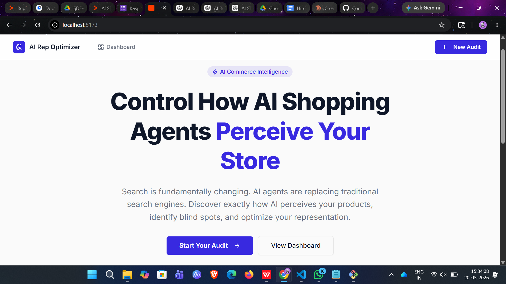

# AI Representation Optimizer

**Hackathon:** Kasparro Commerce Hackathon — Track 5 (Advanced): AI Representation Optimizer  
**Participant:** Solo submission

---

## What This Is

AI Representation Optimizer is a merchant-facing diagnostic tool that helps Shopify stores understand how AI shopping agents (ChatGPT, Gemini, Perplexity) currently perceive and represent them — and what to do about it.

When an AI agent recommends products, it pulls from store data: descriptions, policies, reviews, FAQs. If that data is incomplete, ambiguous, or contradictory, the AI skips the merchant or misrepresents them. This tool makes that problem visible and actionable.

**Live Demo:** [Deployed on Replit]

---

## Problem Statement

Most Shopify merchants have no visibility into how AI shopping agents represent their store. There's no bounce rate for an AI recommendation that never happened. As AI-mediated commerce grows (Shopify's Agentic Plan is a signal), merchants who don't optimize for AI discoverability will lose traffic they can't see or measure.

---

## How It Works

1. Merchant enters their store data (name, URL, product descriptions, policies, FAQs, brand story)
2. The tool analyzes the data across 6 AI-readiness dimensions using Gemini AI
3. Returns: overall score (0-100), per-dimension grades (A+ to F), "how AI currently perceives your store" narrative, and a prioritized action plan
4. Merchant downloads a full markdown audit report

**The 6 dimensions scored:**
- Product Description Quality
- Policy Completeness
- Trust Signal Strength
- FAQ & Query Coverage
- Structured Data & Metadata
- Pricing & Inventory Clarity

---

## Setup Instructions

### Prerequisites
- Node.js 24+
- pnpm 10+
- PostgreSQL (or use Replit's managed database)

### Environment Variables

```bash
DATABASE_URL=postgresql://...
AI_INTEGRATIONS_GEMINI_BASE_URL=...   # Auto-set on Replit
AI_INTEGRATIONS_GEMINI_API_KEY=...    # Auto-set on Replit
```

On Replit: the AI integration and database are provisioned automatically. No API keys needed.

### Installation

```bash
# Install dependencies
pnpm install

# Push database schema
pnpm --filter @workspace/db run push

# Run API server (development)
pnpm --filter @workspace/api-server run dev

# Run frontend (development)
pnpm --filter @workspace/ai-rep-optimizer run dev
```

### Code Generation

After changing `lib/api-spec/openapi.yaml`:
```bash
pnpm --filter @workspace/api-spec run codegen
```

---

## Architecture

```
pnpm monorepo
├── artifacts/
│   ├── api-server/          # Express 5 backend
│   └── ai-rep-optimizer/    # React + Vite frontend
├── lib/
│   ├── api-spec/            # OpenAPI YAML + Orval config
│   ├── api-client-react/    # Generated React Query hooks
│   ├── api-zod/             # Generated Zod validation schemas
│   ├── db/                  # Drizzle ORM schema + client
│   └── integrations-gemini-ai/  # Gemini AI client
```

See `TECHNICAL_DOCUMENT.md` for full architecture documentation.

---

## Documentation

- **[PRODUCT_DOCUMENT.md](./PRODUCT_DOCUMENT.md)** — Problem framing, target user, product decisions, and tradeoffs
- **[TECHNICAL_DOCUMENT.md](./TECHNICAL_DOCUMENT.md)** — Architecture, implementation decisions, failure handling, known limitations
- **[DECISION_LOG.md](./DECISION_LOG.md)** — Running log of every key decision made during the build (D001–D012)

---

## Contribution Note (Solo Submission)

As a solo participant, I split my time across all phases:

| Phase | Time Allocation |
|-------|----------------|
| Problem framing + product thinking | ~25% |
| Architecture + API design | ~20% |
| Backend (AI engine + routes + DB) | ~25% |
| Frontend (UI + polish) | ~20% |
| Documentation | ~10% |

All product decisions, architecture choices, and implementation were made and executed independently.

---


## Screenshots

### Landing Page


---

### Audit Form Flow


---

### AI Audit Analysis


---

### Ask Audit Feature


---

### Dashboard


---

### Audit Comparison

---

## Demo Video

[YouTube/Drive link — 3-5 minute screen recording with narration]

---

## Tech Stack

- **Runtime:** Node.js 24, TypeScript 5.9
- **Frontend:** React 19, Vite, Tailwind CSS, shadcn/ui, Recharts
- **Backend:** Express 5
- **Database:** PostgreSQL + Drizzle ORM
- **AI:** Google Gemini 2.5 Flash (via Replit AI Integrations)
- **API Contract:** OpenAPI → Orval codegen (React Query hooks + Zod schemas)
- **Monorepo:** pnpm workspaces
